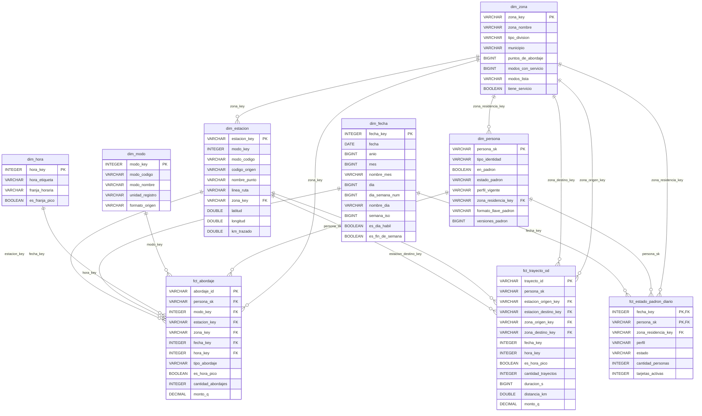

# Modelo dimensional Gold

Generado por `scripts/exportar_modelo.py` desde el warehouse y los tests de dbt. Las llaves primarias salen de los tests `unique` y las foráneas de los tests `relationships`.

